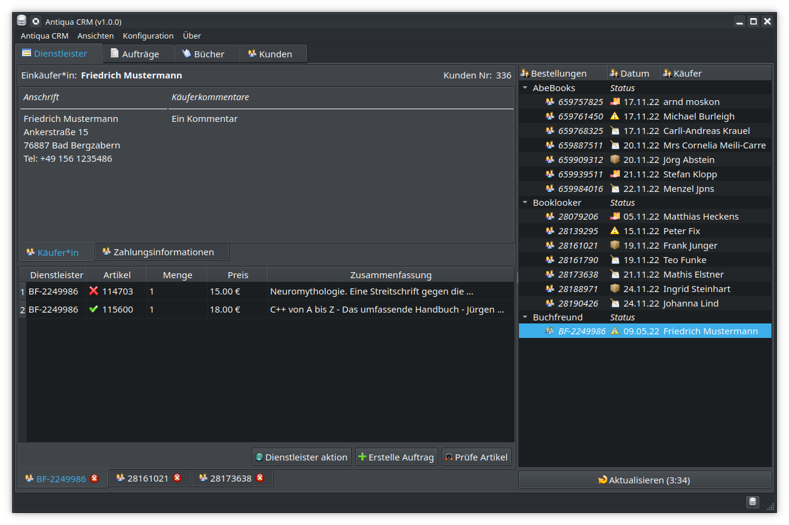

# Antiqua CRM
Ist ein Programm zur Verwaltung von Antiquarischen Büchern.

Es bietet eine Verwaltung der Artikelbestände und einige Online Schnittstellen für eine vereinfachte Datenverwaltung zu einzelnen Dienstanbietern.

Das Programm wird mit der Qt-C++ Version 5.12.* Community Lizens geschrieben und verwendet eine PostgreSQL Datenbank ab Version 14.* für die Datenverwaltung.

#### Zur Zeit sind folgende Funktionen enthalten:
- Klient Anwendung:
  - Kunden Adressbuch,
  - Buch, Drucke+Stiche und CD+Vinyl Verwaltung,
  - Auftrags/Bestellverwaltung *(Ist abhängig von der Serveranwendung!)*,
  - Remote Office über SSL/TLS,
  - Bilder Verwaltung *(Über CIFS/SMB Schnittstelle >= 2.\* im lokalen Netzwerk)*,
  - Statistiken.

> Die Klientanwendung stellt keine Remoteanfragen zu den Dienstleistern!
Dies macht die Serveranwendung mittels eines CronJob-Intervals.
Die Serveranwendung fügt die Bestellungen in die Datenbanlk ein.

- Server Anwendung:
  - Dienstleisterabfrage der Bestellungen und einfügen in das Auftragssystem.
  - CronJob-Scripte: Zum täglichen Hochladen der Bilder und Update der Datenbestände.

---

